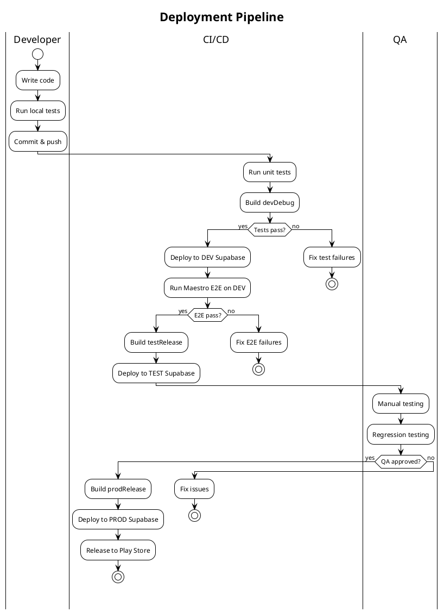

# Multi-Environment Strategy: Dev / Test / Prod

## Overview

```
┌─────────────────────────────────────────────────────────────────────┐
│                         ENVIRONMENTS                                 │
├─────────────────┬─────────────────────┬─────────────────────────────┤
│      DEV        │        TEST         │           PROD              │
├─────────────────┼─────────────────────┼─────────────────────────────┤
│ Local dev       │ QA / Staging        │ Production users            │
│ Self-notifs ON  │ Self-notifs ON      │ Self-notifs OFF             │
│ Debug builds    │ Debug/Release builds│ Release builds only         │
│ Rapid iteration │ E2E testing         │ Stable, monitored           │
└─────────────────┴─────────────────────┴─────────────────────────────┘
```

---

## 1. Supabase Projects

### Option A: Separate Projects (Recommended)
Three independent Supabase projects with isolated databases.

```
┌────────────────┐  ┌────────────────┐  ┌────────────────┐
│  supabase-dev  │  │  supabase-test │  │  supabase-prod │
├────────────────┤  ├────────────────┤  ├────────────────┤
│ DB: dev data   │  │ DB: test data  │  │ DB: prod data  │
│ Auth: dev users│  │ Auth: QA users │  │ Auth: real     │
│ Functions: dev │  │ Functions: test│  │ Functions: prod│
└────────────────┘  └────────────────┘  └────────────────┘
```

**Pros:** Complete isolation, no risk of cross-contamination
**Cons:** More projects to manage, separate billing

### Option B: Single Project with Branching (Supabase Branching)
Use Supabase's branching feature for preview environments.

```
main (prod) ─────────────────────────────────────►
     │
     ├── preview/test ──────────────────────────►
     │
     └── preview/dev ───────────────────────────►
```

**Pros:** Easier migrations, single project
**Cons:** Still in beta, shared billing limits

### Recommendation: Option A for now

| Environment | Supabase Project | URL Pattern |
|-------------|------------------|-------------|
| dev | `claude-lists-dev` | `xxx-dev.supabase.co` |
| test | `claude-lists-test` | `xxx-test.supabase.co` |
| prod | `claude-lists-prod` | `xxx-prod.supabase.co` |

---

## 2. Android Build Variants

### build.gradle.kts Configuration

```kotlin
android {
    // ...

    flavorDimensions += "environment"

    productFlavors {
        create("dev") {
            dimension = "environment"
            applicationIdSuffix = ".dev"
            versionNameSuffix = "-dev"
            buildConfigField("String", "SUPABASE_URL", "\"https://xxx-dev.supabase.co\"")
            buildConfigField("String", "SUPABASE_ANON_KEY", "\"dev-anon-key\"")
            buildConfigField("String", "GOOGLE_WEB_CLIENT_ID", "\"dev-client-id\"")
            buildConfigField("Boolean", "ENABLE_SELF_NOTIFICATIONS", "true")
            resValue("string", "app_name", "Court Lists DEV")
        }

        create("test") {
            dimension = "environment"
            applicationIdSuffix = ".test"
            versionNameSuffix = "-test"
            buildConfigField("String", "SUPABASE_URL", "\"https://xxx-test.supabase.co\"")
            buildConfigField("String", "SUPABASE_ANON_KEY", "\"test-anon-key\"")
            buildConfigField("String", "GOOGLE_WEB_CLIENT_ID", "\"test-client-id\"")
            buildConfigField("Boolean", "ENABLE_SELF_NOTIFICATIONS", "true")
            resValue("string", "app_name", "Court Lists TEST")
        }

        create("prod") {
            dimension = "environment"
            // No suffix - this is the main app
            buildConfigField("String", "SUPABASE_URL", "\"https://xxx-prod.supabase.co\"")
            buildConfigField("String", "SUPABASE_ANON_KEY", "\"prod-anon-key\"")
            buildConfigField("String", "GOOGLE_WEB_CLIENT_ID", "\"prod-client-id\"")
            buildConfigField("Boolean", "ENABLE_SELF_NOTIFICATIONS", "false")
            resValue("string", "app_name", "Court Lists")
        }
    }
}
```

### Resulting Build Variants

```
devDebug      - Local development
devRelease    - Dev environment release build
testDebug     - QA testing with debug tools
testRelease   - QA testing release candidate
prodDebug     - (rarely used)
prodRelease   - Production release
```

### App Icons per Environment

```
app/src/dev/res/mipmap-*/ic_launcher.png   → Green tinted icon
app/src/test/res/mipmap-*/ic_launcher.png  → Orange tinted icon
app/src/prod/res/mipmap-*/ic_launcher.png  → Normal icon (or in main/)
```

---

## 3. Supabase Configuration Structure

### Directory Layout

```
supabase/
├── config.toml              # Shared config
├── environments/
│   ├── dev.env              # Dev secrets (gitignored)
│   ├── test.env             # Test secrets (gitignored)
│   └── prod.env             # Prod secrets (gitignored)
├── migrations/              # Shared migrations
│   ├── 001_initial.sql
│   ├── 002_notifications.sql
│   └── ...
└── functions/               # Edge functions (same code, different config)
    ├── listings/
    ├── cases/
    └── ...
```

### Environment Variables per Project

```bash
# dev.env
SUPABASE_PROJECT_ID=xxx-dev
SUPABASE_DB_PASSWORD=dev-password
GOOGLE_SERVICE_ACCOUNT=dev-service-account.json

# test.env
SUPABASE_PROJECT_ID=xxx-test
SUPABASE_DB_PASSWORD=test-password
GOOGLE_SERVICE_ACCOUNT=test-service-account.json

# prod.env
SUPABASE_PROJECT_ID=xxx-prod
SUPABASE_DB_PASSWORD=prod-password
GOOGLE_SERVICE_ACCOUNT=prod-service-account.json
```

---

## 4. Deployment Pipeline



### ASCII Version

```
Developer          CI/CD                    QA
    │                 │                      │
    ├──commit/push───►│                      │
    │                 ├──unit tests          │
    │                 ├──build devDebug      │
    │                 ├──deploy DEV          │
    │                 ├──E2E tests           │
    │                 │                      │
    │                 ├──build testRelease   │
    │                 ├──deploy TEST────────►│
    │                 │                      ├──manual test
    │                 │                      ├──approve
    │                 │◄─────────────────────┤
    │                 ├──build prodRelease   │
    │                 ├──deploy PROD         │
    │                 ├──Play Store release  │
    │                 │                      │
```

---

## 5. Database Migration Strategy

### Migration Flow

```
1. Write migration in supabase/migrations/
2. Test locally with `supabase db reset`
3. Apply to DEV: `supabase db push --project-ref xxx-dev`
4. Verify DEV working
5. Apply to TEST: `supabase db push --project-ref xxx-test`
6. QA verification
7. Apply to PROD: `supabase db push --project-ref xxx-prod`
```

### Rollback Strategy

```sql
-- Each migration should have a corresponding rollback
-- migrations/002_notifications.sql
-- rollback/002_notifications_rollback.sql

-- Or use transactional migrations with explicit rollback
BEGIN;
  -- migration code
COMMIT;
-- ROLLBACK; (if needed)
```

---

## 6. Secret Management

### Secrets per Environment

| Secret | Dev | Test | Prod |
|--------|-----|------|------|
| `SUPABASE_URL` | xxx-dev.supabase.co | xxx-test.supabase.co | xxx-prod.supabase.co |
| `SUPABASE_ANON_KEY` | dev-key | test-key | prod-key |
| `SUPABASE_SERVICE_ROLE_KEY` | dev-service | test-service | prod-service |
| `GOOGLE_WEB_CLIENT_ID` | dev-oauth | test-oauth | prod-oauth |
| `FCM_SERVER_KEY` | shared or per-env | shared or per-env | prod-fcm |

### Storage Options

1. **GitHub Secrets** - For CI/CD
2. **Local .env files** - For development (gitignored)
3. **Supabase Vault** - For Edge Function secrets
4. **Google Secret Manager** - For production secrets

---

## 7. Implementation Steps

### Phase 1: Create Supabase Projects
- [ ] Create `claude-lists-test` project
- [ ] Create `claude-lists-prod` project
- [ ] Run migrations on both
- [ ] Set up auth providers on both
- [ ] Deploy Edge Functions to both

### Phase 2: Android Build Variants
- [ ] Add productFlavors to build.gradle.kts
- [ ] Create environment-specific resource directories
- [ ] Add BuildConfig fields for URLs/keys
- [ ] Create different app icons per environment
- [ ] Update google-services.json handling

### Phase 3: CI/CD Pipeline
- [ ] Set up GitHub Actions workflow
- [ ] Add secrets for each environment
- [ ] Configure build matrix for variants
- [ ] Add Maestro E2E test step
- [ ] Add deployment steps

### Phase 4: Documentation
- [ ] Update README with environment info
- [ ] Document deployment process
- [ ] Create runbook for production issues

---

## 8. Quick Reference Commands

```bash
# Build specific variant
./gradlew assembleDevDebug
./gradlew assembleTestRelease
./gradlew assembleProdRelease

# Install specific variant
./gradlew installDevDebug
./gradlew installTestDebug

# Deploy functions to specific project
supabase functions deploy --project-ref xxx-dev
supabase functions deploy --project-ref xxx-test
supabase functions deploy --project-ref xxx-prod

# Push migrations to specific project
supabase db push --project-ref xxx-dev
supabase db push --project-ref xxx-test
supabase db push --project-ref xxx-prod

# Run E2E tests against specific variant
MAESTRO_APP_ID=com.claudelists.app.dev maestro test .maestro/
MAESTRO_APP_ID=com.claudelists.app.test maestro test .maestro/
```

---

## 9. Cost Considerations

| Supabase Plan | Dev | Test | Prod |
|---------------|-----|------|------|
| Free | ✓ | ✓ | ✗ |
| Pro ($25/mo) | ✗ | ✗ | ✓ |

- Dev and Test can use Free tier (with limitations)
- Prod should be on Pro for reliability and support
- Consider: shared Test/Dev project if cost is a concern

---

## Summary Diagram

```
┌─────────────────────────────────────────────────────────────────────────┐
│                            SOURCE CODE                                   │
│                         (Single Codebase)                               │
└─────────────────────────────┬───────────────────────────────────────────┘
                              │
        ┌─────────────────────┼─────────────────────┐
        ▼                     ▼                     ▼
┌───────────────┐     ┌───────────────┐     ┌───────────────┐
│   DEV Build   │     │  TEST Build   │     │  PROD Build   │
│  .app.dev     │     │  .app.test    │     │  .app         │
│  Green Icon   │     │  Orange Icon  │     │  Normal Icon  │
└───────┬───────┘     └───────┬───────┘     └───────┬───────┘
        │                     │                     │
        ▼                     ▼                     ▼
┌───────────────┐     ┌───────────────┐     ┌───────────────┐
│ Supabase DEV  │     │ Supabase TEST │     │ Supabase PROD │
│ - Dev DB      │     │ - Test DB     │     │ - Prod DB     │
│ - Dev Auth    │     │ - Test Auth   │     │ - Prod Auth   │
│ - Dev Funcs   │     │ - Test Funcs  │     │ - Prod Funcs  │
└───────────────┘     └───────────────┘     └───────────────┘
```
